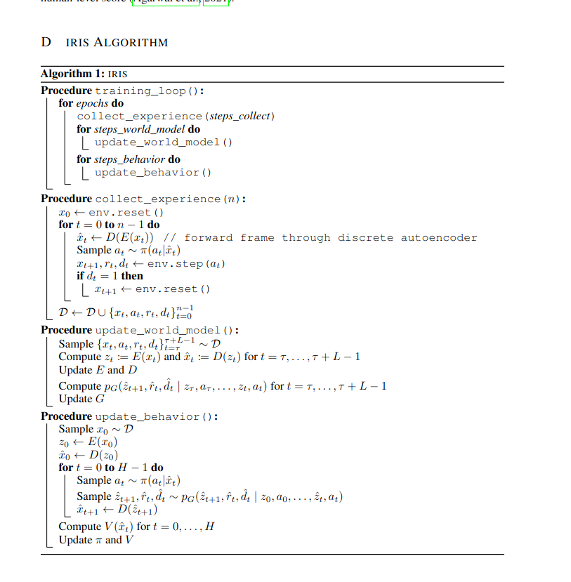

# 2023-11-12 13:17:35

Try IRIs but with pretrained transformer with LoRA adapter

- [x] first can I run it yes with a 1/2 batch size
- [ ] then can I add 3B with adapter...

```sh
poetry install
. ./.venv/bin/activate
python src/main.py env.train.id=BreakoutNoFrameskip-v4 common.device=cuda:0 wandb.mode=offline

# or for quick debug
WANDB_MODE=disabled python -m pdb src/main.py env.train.id=BreakoutNoFrameskip-v4
```


```sh
# TODO use this code to load a transformer, and other code from my bigvae repo https://github.com/wassname/bigvae_wm
def load_model(config, device='cuda'):
    tokenizer = AutoTokenizer.from_pretrained(config.model_name, trust_remote_code=True)
    tokenizer.padding_side = "left"
    if tokenizer.pad_token is None:
        tokenizer.pad_token = tokenizer.eos_token
    bnb_config = BitsAndBytesConfig(
        load_in_4bit=True,
        bnb_4bit_compute_dtype=torch.bfloat16,
        bnb_4bit_quant_type="nf4",
        bnb_4bit_use_double_quant=True,
    )
    base_model = AutoModelForCausalLM.from_pretrained(
        config.model_name,
        device_map={"": device},
        quantization_config=bnb_config,
        torch_dtype=torch.bfloat16, 
        trust_remote_code=True
    )
    peft_config = peft.LoraConfig(
        peft.TaskType.CAUSAL_LM,
        inference_mode=False,
        r=config.rank,
        lora_alpha=8,
        lora_dropout=config.dropout,
        target_modules=[
            "self_attn.q_proj",
            "self_attn.k_proj",
            "self_attn.v_proj",
            "self_attn.o_proj",
            "mlp.gate_proj",
            "mlp.up_proj",
            "mlp.down_proj",
        ],
    )
    base_model_peft = peft.get_peft_model(base_model, peft_config)
    vae_model = BigVAE(
        base_model_peft, device, peft_config, z_dim=config.z_dim,
    )
    if config.start_from:
        vae_model.load_pretrained(config.start_from)
    base_model_peft.requires_grad_(False)
    vae_model.vae_head.requires_grad_(False)
    vae_model.vae_head.w_d.requires_grad_()
    router = BigVAERouter(base_model_peft, vae_model, device, peft_config)
    if config.start_from:
        router.load_pretrained(config.start_from, is_trainable=True)
    print(router.model.print_trainable_parameters())
    router.model.set_adapter("router")
```

Debugging:
    batch['observations'].shape
    torch.Size([16, 20, 3, 64, 64])

    obs_tokens.shape
    torch.Size([16, 20, 16])

    https://vscode.dev/github/wassname/iris_bigvae/blob/just_llms2/src/models/world_model.py#L105
    tokens
    tensor([[222, 222, 222,  ..., 409,  55,   2],
            [222, 222, 222,  ..., 409, 139,   1],
            [222, 222, 222,  ..., 168, 190,   3],
            ...,
            [222, 222, 222,  ..., 168,  55,   0],
            [222, 222, 222,  ..., 237, 190,   3],
            [222, 222, 222,  ..., 168,  55,   0]], device='cuda:0')
    tokens.shape
    torch.Size([16, 340])
    where 16 is the batch size. 340 is the step size?. actions was 16,20 int

    tokens.shape int
    torch.Size([16, 340])

    sequences.shape float32
    torch.Size([16, 340, 256])

    transfrmer
    x.shape
    torch.Size([16, 340, 256])

# 2023-11-12 16:58:37

So I got it training, but during imagination it passes in a single token with no past steps. But the slicer seems to need at least on block? And so I get none?

hmm it's because num_kept_tokens is 16 not 1. So there should be a whole block passed in ?

wait apparently it's also a problem in the normal repo.... I confuse! maybe it's my config! maybe I need >larger than block size. nope

hmm it still happens in the original repo with my debug params. maybe it's my debug params


... trying a full run without my debug params...

note trains.world_model.batch_num_samples:4 fill 20GB gpu ram for the 3b stability ai llm

ok even with a full run I get the error. I think it's a bug in the original repo. I'll try to debug it there.

    Epoch 51 / 600

    Experience collection (train_dataset): 100%|███████████████████████████████████████████████████████████████████████████████████████████████████████████████████████████████████████████████████████████| 200/200 [00:03<00:00, 59.91it/s]
    Training tokenizer: 100%|██████████████████████████████████████████████████████████████████████████████████████████████████████████████████████████████████████████████████████████████████████████████| 200/200 [00:17<00:00, 11.53it/s]
    Training world_model: 100%|████████████████████████████████████████████████████████████████████████████████████████████████████████████████████████████████████████████████████████████████████████████| 200/200 [02:11<00:00,  1.53it/s]
    Training actor_critic:   0%|                                                                                                                                                                                     | 0/200 [00:00<?, ?it/s]
    Error executing job with overrides: ['env.train.id=BreakoutNoFrameskip-v4', 'common.device=cuda:0', 'wandb.mode=offline']
    Traceback (most recent call last):
    File "/media/wassname/SGIronWolf/projects5/worldmodels/iris_bigvae/src/main.py", line 10, in main
        trainer.run()
    File "/media/wassname/SGIronWolf/projects5/worldmodels/iris_bigvae/src/trainer.py", line 111, in run
        to_log += self.train_agent(epoch)
    File "/media/wassname/SGIronWolf/projects5/worldmodels/iris_bigvae/src/trainer.py", line 146, in train_agent
        metrics_actor_critic = self.train_component(self.agent.actor_critic, self.optimizer_actor_critic, sequence_length=1 + self.cfg.training.actor_critic.burn_in, sample_from_start=False, tokenizer=self.agent.tokenizer, world_model=self.agent.world_model, **cfg_actor_critic)
    File "/media/wassname/SGIronWolf/projects5/worldmodels/iris_bigvae/src/trainer.py", line 161, in train_component
        losses = component.compute_loss(batch, **kwargs_loss) / grad_acc_steps
    File "/media/wassname/SGIronWolf/projects5/worldmodels/iris_bigvae/src/models/actor_critic.py", line 102, in compute_loss
        outputs = self.imagine(batch, tokenizer, world_model, horizon=imagine_horizon)
    File "/media/wassname/SGIronWolf/projects5/worldmodels/iris_bigvae/src/models/actor_critic.py", line 149, in imagine
        obs, reward, done, _ = wm_env.step(action_token, should_predict_next_obs=(k < horizon - 1))
    File "/media/wassname/SGIronWolf/projects5/worldmodels/iris_bigvae/.venv/lib/python3.9/site-packages/torch/utils/_contextlib.py", line 115, in decorate_context
        return func(*args, **kwargs)
    File "/media/wassname/SGIronWolf/projects5/worldmodels/iris_bigvae/src/envs/world_model_env.py", line 75, in step
        reward = Categorical(logits=outputs_wm.logits_rewards).sample().float().cpu().numpy().reshape(-1) - 1   # (B,)
    File "/media/wassname/SGIronWolf/projects5/worldmodels/iris_bigvae/.venv/lib/python3.9/site-packages/torch/distributions/categorical.py", line 70, in __init__
        super().__init__(batch_shape, validate_args=validate_args)
    File "/media/wassname/SGIronWolf/projects5/worldmodels/iris_bigvae/.venv/lib/python3.9/site-packages/torch/distributions/distribution.py", line 66, in __init__
        valid = constraint.check(value)
    File "/media/wassname/SGIronWolf/projects5/worldmodels/iris_bigvae/.venv/lib/python3.9/site-packages/torch/distributions/constraints.py", line 226, in check
        result = result.reshape(
    RuntimeError: cannot reshape tensor of 0 elements into shape [8, 0, -1] because the unspecified dimension size -1 can be any value and is ambiguous

Oh maybe it's because we don't keep track of KV cache, but it's actually used to track number of steps!!

# 2023-11-13 20:11:51

I go it working byt ut takes 30 seconds for one one actor critic batch, werird

Experience collection (train_dataset): 100%|███████████████████████████████████████████████████████████████████████████████████████████████████████████████████████████████████████████████████████████| 200/200 [00:03<00:00, 60.45it/s]
Training tokenizer: 100%|██████████████████████████████████████████████████████████████████████████████████████████████████████████████████████████████████████████████████████████████████████████████| 200/200 [00:17<00:00, 11.26it/s]
Training world_model: 100%|████████████████████████████████████████████████████████████████████████████████████████████████████████████████████████████████████████████████████████████████████████████| 200/200 [02:12<00:00,  1.51it/s]
Training actor_critic:  82%|███████████████████████████████████████████████████████████████████████████████████████████████████████████████████████████████████████████▍                             | 165/200 [1:01:43<13:24, 22.99s/it]


hm maybe it's just the face it has to backprop throguh the whole LLM :( damn... is there another way to train it? Daym. How many params did the original have?

well running eval on the transformer brought it down from 100sec to 60, but it's still huge. 

But then why is the model training fast? It makes not sense
 
# 2023-11-16 12:54:48

Why is agent so slow? Lets find out
- look at diagram
- look at train_agent
  - to tokenizer.compute_loss is just tokenizer
  - world_model.compute_loss user tokenizer with no grad
  - actor_critic? takes an hour!!
    - imagine (with grad?)
      - x20 = horizon
        - self(obs)
        - WorldModelEnv.step this has no grad!
          - transformer
          - tokenizer with no grad
    - compute_lambda_returns with no grad


So changes:
- the world model step always had no grad!
- I just made the lstm smaller and the horizon smaller
- from 1h to 3m. Reasonable.


Experiment: 
- try no grad on the model? ok it now takes 20 minutes to train... still slow
with a smaller lstm and only 10 steos ut tajes 8 mins,



Experience collection (train_dataset): 100%|████████████████████████████████████████████████████████████████████████████████████████████████████████████████████████| 200/200 [00:05<00:00, 36.11it/s]
Training tokenizer: 100%|███████████████████████████████████████████████████████████████████████████████████████████████████████████████████████████████████████████| 200/200 [00:55<00:00,  3.61it/s]
Training world_model: 100%|█████████████████████████████████████████████████████████████████████████████████████████████████████████████████████████████████████████| 200/200 [01:12<00:00,  2.76it/s]
Training tokenizer: 55sec
Training world_model 72 sec
train actor_critic 3min. It looks like it scales with lstm size!


new changes 10mins
lets try no lstm?
Right now it will take 41 hours for on epoch lol


ram during stages:
- actor critic 20G/24


how big does my actor critic need to be?
- IRIS: large 512 lstm on 64,64,3 obs
  - We ran our experiments with 8 Nvidia A100 40GB GPUs. With two Atari environments running on the same GPU, training takes around 7 days, resulting in an average of 3.5 days per environment.
- twm: mlp 512


How long to train?
`600*10//6/24` = 41 days
- 600 epochs * 10 minutes / 6 to get hours, 24 to get days

# 2023-11-17 07:59:44

so I've got it working with  these times. But maybe it's too small

Epoch 148 / 600

Experience collection (train_dataset): 100%|████████████████████████████████████████████████████████████████████████████████████████████████████████████████████████████████████████████████| 200/200 [00:10<00:00, 19.25it/s]
Training tokenizer: 100%|███████████████████████████████████████████████████████████████████████████████████████████████████████████████████████████████████████████████████████████████████| 200/200 [00:59<00:00,  3.34it/s]
Training world_model: 100%|█████████████████████████████████████████████████████████████████████████████████████████████████████████████████████████████████████████████████████████████████| 200/200 [01:15<00:00,  2.64it/s]
Training actor_critic: 100%|██████████████████████████████████████████████████████████████████████████████████████████████████████████████████████████████████████████████████████████████████| 20/20 [03:20<00:00, 10.05s/it]


- what about resume? oh we seem to have that although the code doesn't make sense https://hydra.cc/docs/tutorials/basic/running_your_app/working_directory/ https://hydra.cc/docs/1.2/upgrades/1.1_to_1.2/changes_to_job_working_dir/ see eval.py
- [ ] but it's still too damn slow. what about bfloat16? using auto case?
- why does it take so long? it would be nice to have a reproduction notebook
- also the model might be to small now....

how to play
```sh
cd outputs/2023-11-17/07-59-44
python scripts/play.sh
```


## Envs

tl:dr just use pong or breakout or crafter (1m steps)

for steps see [crafter paper](https://arxiv.org/pdf/2109.06780.pdf)

Nethack learning env. What's the obs size? 21x79 of glyphs (5991 possibilities) and 21 dim of stats
- they use an lstm of 128. 5 layer conv
- requires 1B steps
- 
atari:
- reqs 200M stpes

progcen:
- 200M steps

minihack:
- 2M steps for room 5xt
- but needs editing to be atari compatible. e.g. 336 × 1264 × 3 pixels
- pixel_crop 64,64,3 or 9x9 crop works!
- lstm 256
- The training on MiniHack’s Room-5x5 task for two million timesteps using our IMPALA baseline takes approximately 4:30 minutes (r

crafter
- reqs 1M steps
- "All agents trained for 1M environment steps in under 24 hours on a single GPU and we repeated the training for 10 random seeds per method. The training reward curves are included in Appendix "


from https://arxiv.org/pdf/2111.09794.pdf
There are several PCG state-varying gridworld environments (
- [MiniGrid](https://minigrid.farama.org/environments/minigrid/), ~~- BabyAI~~
- Crafter,
- 2019 [Rogue-gym,](https://github.com/kngwyu/rogue-gym) 
- 2020 MarsExplorer, maxe exploration. 1M steps
- NLE, 
- MiniHack; 
- [gym\_nethack](http://campbelljc.com/research/gym_nethack/)
- 2018 [rogueinabox](https://github.com/rogueinabox/rogueinabox)
- [rogue-gym](https://github.com/kngwyu/rogue-gym)
- [MiniGrid](https://github.com/maximecb/gym-minigrid)
- 2019 [CoinRun](https://github.com/openai/coinrun) no traction or maintanance
- [MineRL](http://minerl.io/docs)
- [Project Malmo](https://www.microsoft.com/en-us/research/project/project-malmo/) miencraft
- [OpenAI Procgen Benchmark](https://openai.com/blog/procgen-benchmark/) 200M steps
- 2020 [Obstacle Tower](https://github.com/Unity-Technologies/obstacle-tower-env) - 3d slow

non-PCG observation-varying continuous control environments
- (RoboSuite, DMC-Remastered, DMC-GB, DCS, KitchenShift, NaturalEnvs MuJoCo; Fan
et al., 2021; Grigsby & Qi, 2020; Hansen & Wang, 2021; Stone et al., 2021; Xing et al., 2021a;
Zhang et al., 2018a), and multi-task continuous control benchmarks which could be adapted
to ZSG (CausalWorld, RLBench, Meta-world; Ahmed et al., 2020; James et al., 2019a; Yu
et al., 2019).

## investigating model slowness

So it's all just that using the transformer to imagine takes almost 0.1s. but it's run so many more times than during training. All my ideas to speed it up don't work.

- [x] eval. no grad
- [x] remove the call for adapter, causal mask each time?
- [ ] lower rank?


Ok so it's all just the
- rollout, controller by max block size. 10x
- the fact that actor_critic can use a larger batch, therefore 4-8x more samples
- for each one it imagines 2

# 2023-11-18 06:17:55

It trained overnight, now I would like to view a replay

Hmm "delta-IRIS" ∆-IRIS 
https://openreview.net/forum?id=o8IDoZggqO
∆-IRIS encodes
new frames by attending to the ongoing trajectory, effec-
tively describing deltas between timesteps.
This new ap-
proach drastically reduces the number of tokens to encode
frames, since they are not encoded independently as in IRIS.
In the Crafter benchmark (Hafner, 2022), ∆-IRIS unlocks
16 out of 22 objectives at the 10M frames mark


# 2023-11-18 16:16:16

Why is it not learning? It's because the dynamics model is total BS!!!

- [ ] Well lets try training it for longer then. It's cheap to train so..
- [ ] also maybe train tokenizer and model together? I have a lot of frozen layers, including the embeddings... so might be better
  - [ ] oh no we do have an unforzen embedder before the transformer or more layers
  - maybe I need a higher rank lora? after all I'm changing a lot from text tokens
  - maybe no tokens, bypass to embedder?


# 2023-11-19 06:45:34

So I tried just trainign the world model for 200 epochs. And with a post_embedding layer. It helped the flickering. But not enougth to actually go for the obvious local minima of the next state equals the last
  
idea
- bypass embedding?, but wait dreamerv3 needed quant z... 
  - yes I am bypassing it by passing in the input_embeds... but maybe I shouldn't
- [x] use same embedding everywhere. e.g. model embedding in encoder decoder?
  - Our embedings is (embed_tokens): Embedding(32000, 2048). So we would need to encode to 32000!


ok we need to freeze it, and change dtype
OK it seems slightly better yay! Lets train it overnight and see

next idea is to the delta-IRIS thing where the tokens only have to encode the diff(obs)

# 2023-11-19 16:50:45 

Seems to be working! Now let's plan delta-IRIS


So IRIS has
- Encoder $E(x_0, a_0) = t_0$
  ```py
  obs_tokens = self.tokenizer.encode(observations, should_preprocess=True).tokens    # (B, C, H, W) -> (B, K)
  ```
- Embed $Emb(t_0) = z_0$
    ```py
    embedded_tokens = self.tokenizer.embedding(self.obs_tokens)     # (B, K, E)
    z = rearrange(embedded_tokens, 'b (h w) e -> b e h w', h=int(np.sqrt(self.num_observations_tokens)))
    ```
- Dynamics $D(z_0, a_0) = z_1$
    ```py
    outputs_wm = self.world_model(token, past_keys_values=self.keys_values_wm)
    ```
- Decoder $D(z_0, a_0) = x_1$
    ```py
    rec = self.tokenizer.decode(z, should_postprocess=True)         # (B, C, H, W)
    ```


but we have tokens vs z

Questions:
- wait why are we just passing in "action_token" to the transformer and not obs? that must have obs in it right... right??? confirm
- in iris-delta how did they pass everything in? I guess obs_prev was tokenized too? I think the slices are annoying so maybe I should just pass things seperatly

# 2023-11-24 10:56:40

If I unfreeze the whole transformer, it seem to learn the most obvious dynamics (the next latent space is the same as the last). 

To summarize
- with Qlora it didn't learn that
- with unfrozen head it didn't
- when training transformer and obs embedding together it did not (frozen llm embeddings)


no it didn't work with tokenizer sep hmm
